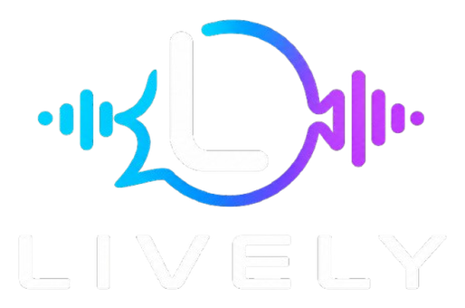

<div align="center">



### **LISTEN. ADAPT. REMEMBER. ACT.**

[](https://python.org)
[](https://reactjs.org)
[](https://fastapi.tiangolo.com)
[](https://www.agora.io)
[](https://groq.com)
[](https://build.nvidia.com)
[](https://vercel.com)
[](https://render.com)

---

**A real-time voice AI sales agent that listens to every word, adapts its strategy on the fly, remembers full deal context across turns, and acts booking demos, dispatching calendar invites, updating CRMs, and escalating to humans all while the buyer is still on the line.**

*Powered by the Agora Conversational AI Engine with a custom multi-LLM brain (Groq LPU + NVIDIA NIM).*

[Features](#core-features) · [Architecture](#system-architecture) · [Quick Start](#quick-start) · [Production Deployment](#production-deployment) · [Demo](#demo-walkthrough) · [Environment Variables](#environment-variables-reference)

---

</div>

<br/>

## Core Features

| Capability | What It Does |
|:---|:---|
| **Real-Time Voice Conversations** | Agora's real-time network with natural turn-taking, semantic end-of-speech detection, barge-in, echo cancellation, and noise suppression. |
| **Adaptive Sales Brain** | Every buyer turn becomes structured signals (intent, seats, budget, authority, timeline, pain points, objections, sentiment) from a small fast LLM, with a rule-based fallback that respects negation. The agent adapts from the live deal state. |
| **Lead Qualification** | Budget, authority, need and timeline start as Unknown and are filled only from what the buyer says. The lead is marked qualified once all four are known. |
| **Persistent Deal Memory** | Additive, mergeable deal state across turns with a full change log (e.g. seats 20 → 80), so the buyer can change requirements or return to earlier topics. |
| **Pricing, Trust & Product Objections** | Pricing, competitor, trust, security, product and latency objections are detected, tracked when repeated, and closed when the buyer accepts the answer or moves on. |
| **Availability-Aware Booking** | Requested times are checked against the demo calendar (working days, demo hours, existing bookings). Taken slots get alternatives; confirmed demos get a shared video room and an `.ics` invite sent in the background. |
| **Human Handoff With Context** | Escalates when the buyer asks for a person, raises legal or contract terms, stays frustrated, or keeps repeating an objection. The AE gets a brief with qualification, objections and the full transcript. |
| **CRM & Activity Log** | Every change updates the lead and its activity log; optional HubSpot sync with a private-app token. |
| **RAG-Grounded Responses** | Pricing, product and competitor battlecards are retrieved per turn; the knowledge base avoids statistics the prompt forbids. |
| **Resilient LLM Routing** | Groq streams each answer; NVIDIA NIM and a built-in brain take over only if the previous provider fails before its first token, so the buyer never hears a restarted answer. |
| **Honest Live Telemetry** | Backend TTFT (request received → first token to Agora), model distribution, failovers and memory diffs, streamed per visitor over an authenticated WebSocket. Nothing is shown until turns are measured. |
| **Per-Visitor Security** | Each visitor gets a private channel with a signed session token; Agora must present a shared secret to call the LLM endpoint; chat and email are rate limited. |
| **Dark / Light Theme** | Editorial luxury design system with full dark mode and one-click Sun/Moon toggle. |

<br/>

---

## System Architecture

```
┌────────────────────────────────────────────────────────────────┐
│                 BROWSER  (React / TypeScript)                  │
│                                                                │
│  Sales Cockpit UI       Agora RTC Web SDK       WebSocket      │
│  ┌──────────────┐      ┌──────────────────┐   ┌────────────┐   │
│  │ Transcript   │      │ Publish Mic Audio│   │ Telemetry  │   │
│  │ Deal Stage   │      │ Subscribe Agent  │   │ Stream     │   │
│  │ Battlecards  │      │ Speech           │   │ /ws/{ch}   │   │
│  │ Telemetry    │      └────────┬─────────┘   └─────┬──────┘   │
│  └──────────────┘                │                   │         │
└──────────────────────────────────┼───────────────────┼─────────┘
                                   │                   │
                                   ▼                   ▼
┌────────────────────────────────────────────────────────────────┐
│            AGORA CONVERSATIONAL AI ENGINE                      │
│                                                                │
│  ● Turn-Taking & VAD       ● Barge-In Handling                 │
│  ● Echo Cancellation       ● Noise Suppression                 │
│  ● Streaming STT ──► [Custom LLM Endpoint] ──► TTS             │
└───────────────────────────────┬────────────────────────────────┘
                                │
                                ▼
┌────────────────────────────────────────────────────────────────┐
│            LIVELY INTELLIGENCE CORE  (FastAPI)                 │
│                                                                │
│  ┌──────────────────────────────────────────────────────────┐  │
│  │               /v1/chat/completions                       │  │
│  │  OpenAI-compatible streaming endpoint called by Agora    │  │
│  │                                                          │  │
│  │  1. LISTEN    → Extract intent, budget, competitors      │  │
│  │  2. ADAPT     → RAG retrieval + next-best-action         │  │
│  │  3. REMEMBER  → Additive deal state merge + change-log   │  │
│  │  4. ACT       → Booking, CRM sync, handoff, invites      │  │
│  └──────────────────────────────────────────────────────────┘  │
│                                                                │
│  ┌────────────────┐  ┌──────────────┐  ┌───────────────────┐   │
│  │  LLM Router    │  │  Tool Layer  │  │ Telemetry Engine  │   │
│  │                │  │              │  │                   │   │
│  │  Groq LPU      │  │ book_meeting │  │ TTFT / p50 / p95  │   │
│  │  (primary)     │  │ update_crm   │  │ Model distrib.    │   │
│  │                │  │ escalate     │  │ Memory diffs      │   │
│  │  NVIDIA NIM    │  │ send_invite  │  │ Stage tracking    │   │
│  │  (fallback)    │  └──────────────┘  └───────────────────┘   │
│  │                │                                            │
│  │  Built-in      │                                            │
│  │  (fallback)    │                                            │
│  └────────────────┘                                            │
│                                                                │
│  ┌──────────────────────────────────────────────────────────┐  │
│  │                   Email & Calendar                       │  │
│  │  SMTP Dispatcher · ICS Calendar Generator · Google Meet  │  │
│  └──────────────────────────────────────────────────────────┘  │
│                                                                │
│  ┌──────────────────────────────────────────────────────────┐  │
│  │                   Storage Layer                          │  │
│  │  SQLite (local dev) / Postgres (production)              │  │
│  │  DealStateTable · EscalationQueue · Analytics            │  │
│  └──────────────────────────────────────────────────────────┘  │
└────────────────────────────────────────────────────────────────┘
```

<br/>

---

## Quick Start (Local Development)

### Prerequisites

| Requirement | Version | Download |
|:---|:---|:---|
| **Python** | 3.11+ | [python.org/downloads](https://www.python.org/downloads/windows/) — check **"Add Python to PATH"** |
| **Node.js** | 18+ | [nodejs.org](https://nodejs.org/) |
| **Git** | Any | [git-scm.com](https://git-scm.com/) |

### Step 1 — Clone the Repository

```bash
git clone https://github.com/anishsmit23/lively.git
cd lively
```

### Step 2 — Install Everything

Double-click **`install.bat`** or run from your terminal:

```cmd
install.bat
```

This automated script:
1. Detects Python and creates a `.venv` virtual environment.
2. Installs backend dependencies from `backend/requirements.txt`.
3. Installs frontend npm packages.
4. Generates `.env` from `.env.example` if missing.
5. Downloads `cloudflared.exe` for the local Agora webhook tunnel.

### Step 3 — Configure API Keys

Open `.env` and fill in your keys:

```env
# ── Agora Conversational AI ──────────────────────
AGORA_APP_ID=your_agora_app_id
AGORA_APP_CERTIFICATE=your_agora_app_certificate
AGORA_REST_KEY=your_agora_rest_key
AGORA_REST_SECRET=your_agora_rest_secret

# ── LLM Providers ────────────────────────────────
GROQ_API_KEY=gsk_...                      # Primary — voice answers + turn understanding
NVIDIA_NIM_API_KEY=nvapi-...              # Fallback if Groq fails before answering

# ── Security ─────────────────────────────────────
LIVELY_LLM_SHARED_SECRET=<random>         # Agora presents this to /v1/chat/completions
SESSION_SECRET=<random>                   # Signs per-visitor session tokens

# ── SMTP / Real Email & Calendar Invites ────────
SMTP_HOST=smtp.gmail.com
SMTP_PORT=587
SMTP_USER=yourname@gmail.com
SMTP_PASSWORD=your_16_char_google_app_password
SMTP_FROM="Lively AI <yourname@gmail.com>"
SMTP_FROM_EMAIL=yourname@gmail.com
SMTP_USE_TLS=true
```

### Step 4 — Launch Lively

Double-click **`run.bat`** or run:

```cmd
run.bat
```

`run.bat` automatically:
- Clears any stale processes on ports 8000 & 5173.
- Launches the Cloudflare tunnel for Agora webhooks.
- Auto-updates `BACKEND_PUBLIC_URL` in `.env`.
- Boots the FastAPI backend on port 8000.
- Boots Vite on port 5173 and opens `http://localhost:5173` in your browser.

*(For separate terminal windows per service, run `run_separate.bat` instead.)*

<br/>

---

## Production Deployment

Lively is configured for zero-friction cloud deployment:

### 1. Frontend (Vercel)
The repository includes a ready-to-use [`vercel.json`](vercel.json):
- **Framework**: Vite
- **Root Directory**: `.`
- **Build Command**: `cd frontend && npm run build`
- **Output Directory**: `frontend/dist`
- **Rewrites**: Automatically routes `/api/*` and `/v1/*` to your Render backend.
- Connect your GitHub repository (`anishsmit23/lively`) in the [Vercel Dashboard](https://vercel.com).

### 2. Backend (Render)
- Deploy as a **Web Service** on [Render](https://render.com).
- **Repository**: `https://github.com/anishsmit23/lively.git` (Branch: `main`)
- **Environment**: `Python 3`
- **Build Command**: `pip install -r backend/requirements.txt`
- **Start Command**: `cd backend && uvicorn app.main:app --host 0.0.0.0 --port $PORT`
- **Environment Variables**:
  - `BACKEND_PUBLIC_URL`: Your Render service URL (e.g. `https://lively-8s3x.onrender.com` without a trailing slash). *(Lively also automatically detects `RENDER_EXTERNAL_URL` if omitted).*
  - `AGORA_APP_ID`, `AGORA_APP_CERTIFICATE`, `AGORA_REST_KEY`, `AGORA_REST_SECRET`
  - `GROQ_API_KEY`
  - `SMTP_USER`, `SMTP_PASSWORD`, `SMTP_FROM_EMAIL` (for direct calendar email dispatches)

<br/>

---

## Demo Walkthrough

Use the built-in **Scripted Demo Harness** tab or speak live into your microphone:

<table>
<tr>
<th width="60">Turn</th>
<th width="220">Buyer Says</th>
<th>Lively Responds</th>
<th width="180">System Action</th>
</tr>
<tr>
<td align="center"><strong>1</strong></td>
<td><em>"Hi, we're evaluating real-time voice AI. How much does Lively cost?"</em></td>
<td>Quotes Starter ($199/mo) and Growth ($699/mo) tiers with 40–60% TCO advantage over alternatives.</td>
<td>RAG retrieval → pricing battlecard</td>
</tr>
<tr>
<td align="center"><strong>2</strong></td>
<td><em>"Wait, how do you compare to OpenAI Realtime and Twilio?"</em> (barge-in)</td>
<td>Triggers competitive battlecard — highlights Agora SD-RTN (&lt;300ms latency) and freedom to swap custom LLM brains.</td>
<td>Competitor detection → battlecard</td>
</tr>
<tr>
<td align="center"><strong>3</strong></td>
<td><em>"Actually our team expanded to 80 users and our budget is $100k ARR. I'm the VP of Product."</em></td>
<td>Acknowledges the updates smoothly without repeating old context.</td>
<td>Additive memory merge → deal state diff</td>
</tr>
<tr>
<td align="center"><strong>4</strong></td>
<td><em>"Can we schedule a live technical walkthrough tomorrow at 2 PM EST?"</em></td>
<td>Checks the demo calendar, books the slot (or offers alternatives if it's taken), and emails the invite with a shared video room link.</td>
<td>Availability check → booking → background invite → CRM activity</td>
</tr>
<tr>
<td align="center"><strong>5</strong></td>
<td><em>"How do I know it won't make things up to our customers?"</em></td>
<td>Explains the guardrails honestly; when the buyer says it makes sense, the objection closes.</td>
<td>Trust objection raised → accepted</td>
</tr>
<tr>
<td align="center"><strong>6</strong></td>
<td><em>"Our legal team needs custom contract terms. Can I talk to a real person?"</em></td>
<td>Tells the buyer an account executive is joining with the full context.</td>
<td>Escalation → handoff brief (qualification, objections, transcript)</td>
</tr>
</table>

<br/>

---

## Project Structure

```
Lively/
│
├── install.bat                 # One-click dependency setup (Python venv, npm, cloudflared)
├── run.bat                     # One-click full system launcher (tunnel + backend + frontend)
├── run_separate.bat            # Launch each service in its own CMD window
├── vercel.json                 # Vercel deployment configuration & API rewrites
├── .env.example                # Environment template with all configurable keys
├── .env                        # Local credentials (git-ignored)
│
├── backend/                     # FastAPI — Lively Intelligence Core
│   ├── app/
│   │   ├── main.py             # FastAPI entry point & router mounting
│   │   ├── config.py           # Pydantic settings with auto Render URL fallback
│   │   ├── api/                # REST & WebSocket route handlers
│   │   │   ├── session.py      # Per-visitor private channel + signed session token
│   │   │   ├── deal_state.py   # State snapshots, contact capture & reset
│   │   │   ├── llm_proxy.py    # OpenAI-compatible /v1/chat/completions endpoint
│   │   │   └── tools.py        # Calendar booking & CRM sync endpoints
│   │   ├── core/               # Cognitive Sales Engine
│   │   │   ├── understanding.py       # Per-turn structured signals (LLM JSON, rule fallback)
│   │   │   ├── deal_state_engine.py   # Qualification, objections, booking, escalation, CRM activity
│   │   │   ├── security.py            # Session tokens, Agora secret check, rate limits
│   │   │   ├── background.py          # Email/DB/CRM work off the voice turn
│   │   │   ├── decision.py            # Next-best-action decision engine
│   │   │   ├── llm_router.py          # Multi-provider LLM routing (Groq → NIM → fallback)
│   │   │   ├── prompts.py            # Persona & autonomous scheduling instructions
│   │   │   ├── rag.py                # RAG retrieval interface
│   │   │   └── tools_defs.py         # Function calling definitions & auto-dispatch
│   │   ├── services/
│   │   │   ├── agora_convo_api.py    # Agora Conversational AI agent lifecycle
│   │   │   └── email_service.py      # SMTP, ICS invites & AE handoff email
│   │   └── routers/
│   │       └── telemetry.py          # WebSocket telemetry connection manager
│   ├── requirements.txt        # Core Python dependencies
│   └── tests/                  # Automated test suites
│
├── frontend/                    # React Sales Cockpit — Vite + TypeScript + Tailwind
│   ├── src/
│   │   ├── App.tsx             # Root component with direct WS & polling fallback
│   │   ├── index.css           # Global styles & design system tokens
│   │   ├── components/
│   │   │   ├── Navbar.tsx              # Brand identity, email pill & theme toggle
│   │   │   ├── LiveTranscriptStream.tsx # Real-time conversation turns
│   │   │   ├── ObjectionBattlecards.tsx # Objection detection & response cards
│   │   │   ├── DealStagePipeline.tsx    # Visual 5-stage pipeline tracker
│   │   │   ├── ActionItemsPanel.tsx     # Live telemetry, TTFT & model stats
│   │   │   ├── CalendarEventCard.tsx    # Clean Google Meet link & auto-dispatched status
│   │   │   ├── OutcomeBanner.tsx        # Reserved outcome banner with Reset button
│   │   │   └── VoiceCallHud.tsx         # WebRTC call controls & audio levels
│   │   ├── services/
│   │   │   └── api.ts                  # API client & WebSocket URL resolution
│   │   └── types/                      # TypeScript schemas & state definitions
│   └── public/
│       ├── logo-light.png      # Brand assets
│       └── logo-dark.png
```

<br/>

---

## Environment Variables Reference

| Variable | Required | Description |
|:---|:---:|:---|
| `AGORA_APP_ID` | Yes | Agora project App ID |
| `AGORA_APP_CERTIFICATE` | Yes | Agora project App Certificate |
| `AGORA_REST_KEY` | Yes | Agora REST API Key |
| `AGORA_REST_SECRET` | Yes | Agora REST API Secret |
| `GROQ_API_KEY` | Recommended | Groq LPU API key — primary low-latency voice turns |
| `GROQ_MODEL` | — | Model name (default: `qwen/qwen3.8-27b`) |
| `EXTRACTION_MODEL` | — | Fast model for per-turn understanding (default: `llama-3.1-8b-instant`) |
| `EXTRACTION_TIMEOUT_SECONDS` | — | Budget for understanding before falling back to rules (default: `0.6`) |
| `NVIDIA_NIM_API_KEY` | — | NVIDIA NIM API key — used if Groq fails before answering |
| `NVIDIA_NIM_MODEL` | — | NIM model (default: `meta/llama-3.2-11b-vision-instruct`) |
| `LIVELY_LLM_SHARED_SECRET` | Production | Secret Agora sends to `/v1/chat/completions` (random per process if unset) |
| `SESSION_SECRET` | Production | Signs visitor session tokens (random per process if unset) |
| `REQUIRE_LLM_SECRET` | — | Reject LLM calls without the secret or a session (default: `true`) |
| `CORS_ALLOWED_ORIGINS` | — | Comma-separated frontend origins (default: localhost dev ports) |
| `MEETING_ROOM_BASE_URL` | — | Host for per-booking video rooms (default: `https://meet.jit.si`) |
| `CALENDAR_WORKING_DAYS` / `CALENDAR_SLOT_TIMES` | — | Demo calendar (default: Mon–Fri, 10:00 / 14:00 / 16:00 EST) |
| `ESCALATION_NOTIFY_EMAIL` | — | AE inbox that receives the handoff brief |
| `HUBSPOT_ACCESS_TOKEN` | — | Optional HubSpot private-app token for CRM sync |
| `BACKEND_PUBLIC_URL` | Cloud | Public URL of the backend (e.g. `https://lively-8s3x.onrender.com`) without trailing slash |
| `SMTP_HOST` | Email | Outgoing mail server (e.g. `smtp.gmail.com`) |
| `SMTP_PORT` | Email | Port for TLS encryption (default: `587`) |
| `SMTP_USER` | Email | Your authenticated mail account (e.g. `you@gmail.com`) |
| `SMTP_PASSWORD` | Email | 16-character Google App Password |
| `SMTP_FROM` | Email | Display header (`"Lively AI <you@gmail.com>"`) |
| `SMTP_FROM_EMAIL` | Email | Sender address matching authenticated account |
| `SMTP_USE_TLS` | Email | Enable TLS encryption (default: `true`) |
| `AGORA_AGENT_VOICE` | — | Voice synthesis model (default: `en-US-JennyNeural`) |
| `DEBUG` | — | Verbose logging only; never disables auth (default: `false`) |

<br/>

---

## Security Model

- **Per-visitor channels.** `POST /api/session` returns a private channel and an HMAC-signed token. Deal-state, tools, RTC-token and agent routes, and the telemetry WebSocket (`?token=`), only work for the token's own channel.
- **Agora → LLM endpoint.** The backend gives Agora `LIVELY_LLM_SHARED_SECRET` as `llm.api_key`; `/v1/chat/completions` rejects calls without it or a visitor session. Set `REQUIRE_LLM_SECRET=false` only if your agent can't send it.
- **No credentials in code.** Every key comes from the environment (see `.env.example`).
- **Rate limits.** New sessions per IP, chat turns per session, and invites per conversation.
- **CORS.** Explicit origins; credentials are never allowed cross-origin.

<br/>

---

## Testing

Run the automated test suite locally (tests disable real email, LLM and CRM calls):

```bash
# Activate virtual environment
.venv\Scripts\activate.bat   # Windows
# source .venv/bin/activate  # macOS / Linux

cd backend
python -m pytest tests -q
```

<br/>

---

<div align="center">

**Built for the [Agora Conversational AI Hackathon](https://www.agora.io)**

Made by the Lively team

</div>
